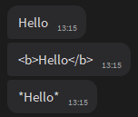
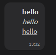
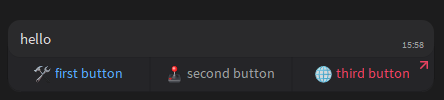
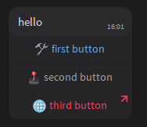

[](https://pypi.org/project/vk-teams-async-bot/)
[](https://pypi.org/project/vk-teams-async-bot/)
[](https://pypi.org/project/vk-teams-async-bot/)


# **Table of Contents**

- [Introduction](#introduction)
- [Installing](#installing)
- [Implemented methods in this library](#implemented-methods-in-this-library)
- [Examples](#examples)
  - [Basic initialization](#basic-initialization)
  - [Send messages](#send-messages)
    - [Without formatting](#without-formatting)
    - [MarkdownV2](#markdownv2) 
  - [InlineKeyboard](#inlinekeyboard)
  - [Middleware](#middleware)


# Introduction
This library provides the ability to interact with VK Teams Bot API.

API description  - https://teams.vk.com/botapi/

[Метабот](https://teams.vk.com/profile/70001) for creating a bot and getting a token.

# Installing
```python
pip install -U vk-teams-async-bot
# OR
poetry add vk-teams-async-bot
```

# Implemented methods in this library


| method | ENDPOINT                       | EXISTS | name in library           |
|--------|--------------------------------|--------|---------------------------|
| GET    | /self/get                      | ✅      | bot.self_get              |
| GET    | /messages/sendText             | ✅      | bot.send_text             |
| GET    | /messages/sendFile             | ✅      | bot.send_file_by_id       |
| POST   | /messages/sendFile             | ✅      | bot.send_file             |
| GET    | /messages/sendVoice            | ✅      | bot.send_voice            |
| POST   | /messages/sendVoice            | ✅      | bot.send_voice_by_id      |
| GET    | /messages/editText             | ✅      | bot.edit_text             |
| GET    | /messages/deleteMessages       | ✅      | bot.delete_msg            |
| GET    | /messages/answerCallbackQuery  | ✅      | bot.answer_callback_query |


# Examples

## Basic initialization
```python
import asyncio

from vk_teams_async_bot.bot import Bot
from vk_teams_async_bot.events import Event
from vk_teams_async_bot.filter import Filter
from vk_teams_async_bot.handler import CommandHandler

app = Bot(bot_token="TOKEN", url="URL")


async def cmd_start(event: Event, bot: Bot):
    await bot.send_text(chat_id=event.chat.chatId, text="Hello")


app.dispatcher.add_handler(
    CommandHandler(callback=cmd_start, filters=Filter.command("/start")),
)


async def main():
    await app.start_polling()


if __name__ == "__main__":
    asyncio.run(main())

```

## Send messages

### Without formatting

```python
async def cmd_start(event: Event, bot: Bot):
    await bot.send_text(chat_id=event.chat.chatId, text="Hello")
    await bot.send_text(chat_id=event.chat.chatId, text="<b>Hello</b>")
    await bot.send_text(chat_id=event.chat.chatId, text="*Hello*")
```
Result:




### MarkdownV2

`parse_mode=ParseMode.MARKDOWNV2`

- All special characters that do not represent the beginning or end of the style must be escaped using a backslash \
#### Methods MarkdownV2
```plain text
1. *hello*   -  bold
2. _hello_   -  italic
3. __hello__ -  underline
4. ~hello~   -  strikethrought
5. [hello](https://example.com) - hyperlinked text
6. @\[user@company\]            - to mention the VK Teams user
7. ```hello```                  - inline code
8. ```python print("hello") ``` - multiline block code
9.  Ordered list:
    1. First element
    2. Second element
10. Unordered list:
    - First element
    - Second element
11. Quote:
    >Begin of quote
    >End of quote
```

```python
async def cmd_start(event: Event, bot: Bot):
    text = \
        """
        *hello*
        _hello_
        __hello__
        """

    await bot.send_text(
        chat_id=event.chat.chatId, text=text, parse_mode=ParseMode.MARKDOWNV2
    )
```
Result:




## InlineKeyboard

```python
from vk_teams_async_bot.constants import StyleKeyboard
from vk_teams_async_bot.handler import CommandHandler
from vk_teams_async_bot.helpers import InlineKeyboardMarkup, KeyboardButton

def keyboad_start_menu():
    keyboard = InlineKeyboardMarkup(buttons_in_row=3)
    keyboard.add(
        KeyboardButton(
            text="🛠 first button",
            callback_data="cb_one",
            style=StyleKeyboard.PRIMARY,
        ),
        KeyboardButton(
            text="🕹 second button",
            callback_data="cb_two",
            style=StyleKeyboard.BASE,
        ),
        KeyboardButton(
            text="🌐 third button",
            url="https://example.com/",
            style=StyleKeyboard.ATTENTION,
        ),
    )
    return keyboard


async def cmd_start(event: Event, bot: Bot):
    text = """hello"""
    await bot.send_text(
        chat_id=event.chat.chatId,
        text=text,
        inline_keyboard_markup=keyboad_start_menu(),
    )
```




You can specify the number of buttons in a row
`InlineKeyboardMarkup(buttons_in_row=1)`



## Middleware
You can check the incoming request or add any data for further use in handlers.

### Check the access rights of the user or group
```python
from vk_teams_async_bot.middleware import Middleware

class AccessMiddleware(Middleware):
    async def handle(self, event, bot):
        allowed_chats = [
            "id@chat.agent",
        ]

        if event.chat.chatId not in allowed_chats:
            text = f"Does not have rights to use the bot - {event.chat.chatId}"
            await bot.send_text(chat_id=event.chat.chatId, text=text)
            raise PermissionError(text)
        return event

async def main():
    app.dispatcher.middlewares = [AccessMiddleware(),]

    await app.start_polling()

if __name__ == "__main__":
    asyncio.run(main())
```


### Add a user or group role
Let's imagine that we have a data source on our side with roles or user rights that we want to use to access a specific menu or handler

```python
from vk_teams_async_bot.middleware import Middleware

class UserRoleMiddleware(Middleware):
    async def handle(self, event, bot):
        roles = {
            "id@chat.agent": "admin",
        }
        event.middleware_data.update({"role": roles.get(event.chat.chatId)})
        logger.debug(
            "UserRoleMiddleware role for {chatID} - {role}".format(
                chatID=event.chat.chatId, role=event.middleware_data.get("role")
            )
        )
        return event


async def main():
    app.dispatcher.middlewares = [UserRoleMiddleware(),]

    await app.start_polling()

if __name__ == "__main__":
    asyncio.run(main())
```


